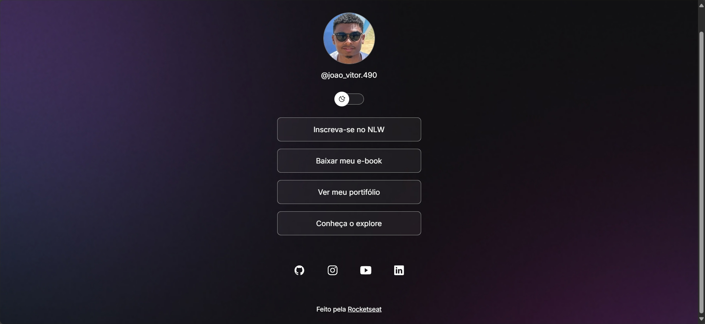
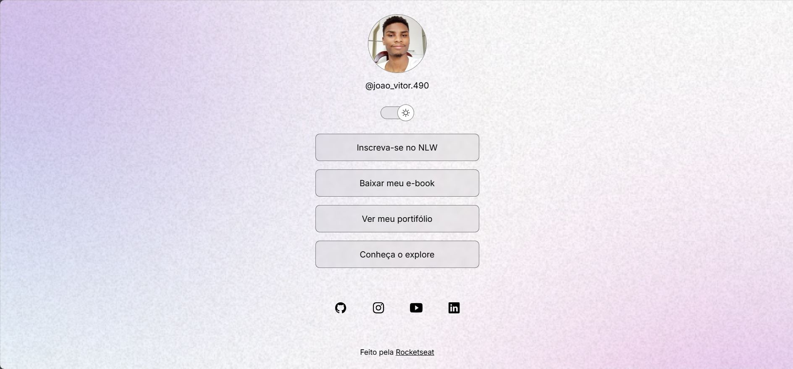

<h1> Devlink </h1>
<br>Um agregador de links que funciona como um cartão de visita digital reunindo em um único local diversos links importantes,
como por exemplos redes sociais, portiólios, sites pessoais, e outros conteúdos relevantes tudo de forma organizada e acessível ideal para 
facilitar a comunicação e a divulgação de informações de forma rápida e eficiente seja para uso pessoal ou profissional.

## Índice 
- [Estrutura ⚙️](#estrutura)
- [Ilustração 🖼️](#ilustracao)
- [Como Rodar ⏯️](#como-rodar)
- [Tecnologias Utilizadas 🛠️](#tecnologias-utilizadas)

## Estrutura ⚙️ <a id="estrutura"></a>
- Contêiner principal `<div id="container">`
- Perfil do usuário `<div id="profile">`
- Botão de alternância de tema `<div id="switch">`
- Lista de links `<ul>`
- Links para redes sociais `<div id="social-links">`
- Rodapé `<footer>`
- Scripts para ícones e funcionalidades
- Reset de CSS
- Variáveis CSS para temas claro e escuro
- Estilos globais e específicos para os elementos
- lógica para alternar entre modos de tema light e dark com a função `toggleMode`

## Ilustração 🖼️ <a id="ilustracao"></a>
<b> Modo escuro:


<b>Modo claro:


## Como Rodar ⏯️ <a id="como-rodar"></a>
Há duas formas de rodar o projeto, a primeira é a forma mais simples que é acessando o deploy Netflify, e a outra é pelos comando Git:

- Git:
```bash

# Clone este repositório "Devlink"
$ git clone https://github.com/JoaoVitorSousa1/Devlink

# Acesse a pasta do projeto no seu terminal
$ cd devlink

# Instale as dependencias 
$ npm install

# execute a aplicação
$ npm run start

```

## Tecnologias Utilizadas 🛠️<a id="tecnologias-utilizadas"></a>
<br>[HTML](https://www.w3schools.com/html/) :
- HTML significa Hyper Text Markup Language (Linguagem demarcação de hipertexto).

- HTML é a linguagem de marcação padrão para criar páginas da Web.

- HTML descreve a estrutura de uma página da Web.

- HTML consiste em uma série de elementos.

- Os elementos HTML informam ao navegador como exibir o conteúdo.

- Os elementos HTML rotulam partes de conteúdo como "este é um título", "este é um parágrafo", "este é um link", etc.

<br>[CSS](https://www.w3schools.com/css/) :
- CSS significa Cascading Style Sheets (Folhas de Estilo em Cascata).

- CSS descreve como os elementos HTML devem ser exibidos na tela, papel, ou em outras mídias.

- CSS economiza muito trabalho. Ele pode controlar o layout de Várias páginas da Web de uma só vez.

- Folhas de estilo externas são armazenadas em arquivos CSS.

<br>[Javascript](https://www.w3schools.com/js/default.asp) :
- JavaScript é a linguagem de programação da web.

- Ele pode atualizar e alterar HTML e CSS.

- Ele pode calcular, manipular e validar dados.